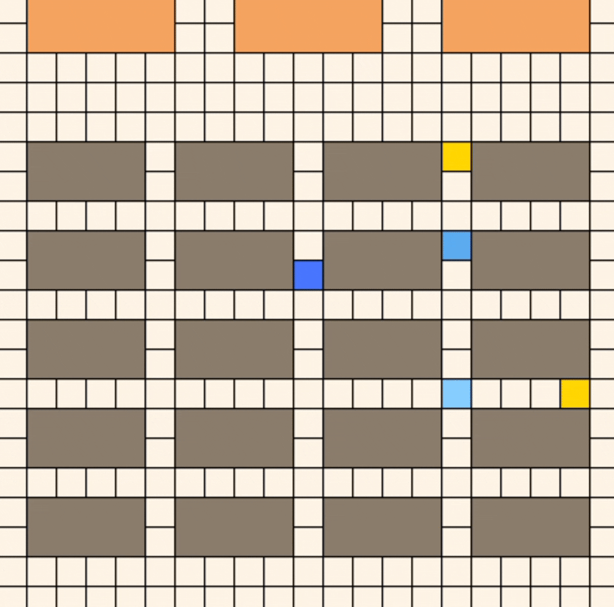

# 多目标协同项目设计

背景：在智慧仓储中，三个机器人会共同收到货物订单，需要合作在最短时间内获取到所有货物。针对每个目标货物，会调度最近的机器人来取货并返回操作台，一个机器人可能需要取一或多个货物。如图所示，蓝色的为机器人，他们从工作台出发，需要在灰色货架中取走黄色货物。



## 整体设计

```Plain
初始化：
    - 创建3个Q学习表 (RL1, RL2, RL3)
    - 初始化共享地图 SharedMap
    - 设置固定目标位置 [(5,5), (7,10), (15,5)]
    - 设置训练参数 (max_episodes=1000, epsilon=0.8→0.05)

for episode in max_episodes:
    1. 环境重置：
       - 清空所有目标
       - 添加固定目标
       - 重置机器人位置
       - 初始化状态变量
    
    2. while 还有可用目标 and step < max_steps:
        a) 目标分配阶段：
           - 对每个机器人，基于Q表选择最优目标
           - 使用ε-贪婪策略平衡探索与利用
        
        b) 动作选择阶段：
           - 基于A*算法计算到目标的最短路径
           - 选择路径的第一步作为当前动作
        
        c) 环境执行阶段：
           - 三个机器人同步执行动作
           - 获取新状态、奖励、完成状态
        
        d) Q表更新阶段：
           - 计算混合奖励 (个人奖励 + 团队奖励)
           - 使用Q-learning公式更新Q表
        
        e) 状态更新阶段：
           - 检查目标完成情况
           - 更新机器人状态
           - 处理碰撞情况
    
    3. 收敛检测：
       - 计算最近N轮的reward方差
       - 如果方差 < 阈值，提前结束训练
    
    4. 保存Q表到文件

输出：训练好的Q表文件
```

## Q-learning学习机制

### 状态空间建模

```Plain
state_str = f"{robot_position}_{target_position}_{completed_bitmap}"
```

具体组成：

- 机器人位置 `robot_position`: `(x1, y1, x2, y2)` 机器人矩形的四个角坐标
- 目标位置 `target_position`: `[target_x, target_y]` 当前分配目标的像素坐标
- 完成状态位图 `completed_bitmap`: 二进制字符串，表示各目标的完成状态

示例状态`(60.0, 40.0, 80.0, 60.0)_[150, 210]_000`表示：

- 机器人位置：(60,40,80,60)
- 目标位置：[150,210]
- 完成状态：000 (所有目标都未完成)

### 动作空间建模

```Python
action_space = [0, 1, 2, 3, 4]  # 对应 ['u', 'd', 'l', 'r', 'w']
```

动作映射：

- 动作0: 向上移动 (Up)
- 动作1: 向下移动 (Down)  
- 动作2: 向右移动 (Right)
- 动作3: 向左移动 (Left)
- 动作4: 等待 (Wait)

### Q-learning调用方法

目标分配中的Q值查询：

```Python
def get_action(self, RL, observation, available_targets, robot_name):
    for target_id in available_targets:
        # 构建状态字符串
        state_str = f"{obs_tuple}_{target_pos}_{completed_bitmap}"
        
        # 查询Q表获取该状态的最大Q值
        if state_str in RL.q_table.index:
            value = RL.q_table.loc[state_str, :].max()  # 关键：获取最大Q值
        else:
            value = 0
        
        # 选择Q值最高的目标
        if value > best_value:
            best_value = value
            best_target = target_id
```

具体流程：

1. 遍历所有可用目标
2. 构建状态字符串：(机器人位置)_(目标位置)_(完成状态位图)
3. 如果这个状态在Q表中存在，获取该状态下所有动作的最大Q值
4. 选择Q值最高的目标作为当前机器人的目标，表示到达这个目标能获得最高的期望奖励。这种机制确保了机器人能够智能地选择最有价值的目标进行导航。

### Q-learning更新公式

Q-learning更新公式：

```Python
def learn(self, s, a, r, s_, alpha=0.1, gamma=0.9):
    q_predict = self.q_table.loc[s, a]  # 当前Q值
    
    if s_ != 'terminal':
        q_target = r + gamma * self.q_table.loc[s_, :].max()  # 目标Q值
    else:
        q_target = r
    
    # Q-learning更新公式
    self.q_table.loc[s, a] += alpha * (q_target - q_predict)
```

数学公式：

$$Q(s,a) ← Q(s,a) + α[r + γ·max(Q(s',a')) - Q(s,a)]$$

参数设置：

- 学习率 α: 0.03 (较小，保证稳定学习)
- 折扣因子 γ: 0.9 (重视长期奖励)

## 多机器人并行协同机制

### 并行执行动作

为了避免每个机器人形成"选择动作-执行动作"的顺序操作，导致在演示画面中有顺序等待行为，我们先让所有机器人完成动作选择，然后同时执行动作。

```Python
# 三个机器人同时选择动作
a1, t1 = self.get_action(self.RL1, obs1, self.env.available_targets, 'robot1')
a2, t2 = self.get_action(self.RL2, obs2, self.env.available_targets, 'robot2')  
a3, t3 = self.get_action(self.RL3, obs3, self.env.available_targets, 'robot3')

# 同步执行所有动作
(obs1_, r1, d1), (obs2_, r2, d2), (obs3_, r3, d3) = self.env.step_multi([a1, a2, a3])
```

### 目标分配机制

```Python
# 基于Q值的贪婪目标分配
for target_id in available_targets:
    state_str = f"{obs_tuple}_{target_pos}_{completed_bitmap}"
    value = RL.q_table.loc[state_str, :].max()  # 获取状态最大Q值
    if value > best_value:
        best_value = value
        best_target = target_id
```

避免机器人选择相同的目标造成冲突：

- 每个机器人独立选择最优目标
- 通过Q值竞争机制自然避免冲突
- 动态更新目标分配

### 路径规划协同

A*路径规划计算从当前位置到目标的路径的第一个动作，返回给机器人执行：

```Python
# 实时路径规划
actions = self.sharemap.find_path(start_pos, target_pos)
next_action = actions[0] if actions else 4
```

动态障碍物处理：

- 共享地图记录所有机器人位置
- 路径规划时考虑其他机器人作为动态障碍物
- 实时更新地图状态

### 奖励机制协同

```Python
# 个人奖励 + 团队奖励
reward_mixed = λ * reward_individual + (1-λ) * reward_team
```

### 状态同步机制

全局状态跟踪，在状态中编码全局信息，让机器人自动避开已完成目标：

```Python
# 完成状态位图
completed_bitmap = ''.join(['1' if tid in self.completed_targets_this_episode else '0' 
                           for tid in self.env.target_positions])
```

状态更新：

- 所有机器人共享完成状态信息
- 实时更新可用目标列表
- 同步清理已完成目标

### 故障处理机制

碰撞处理：

```Python
if d1 == 'hit':
    freeze1 = True  # 冻结机器人
    self.robot_paths['robot1'] = None
    self.executing_robots.discard('robot1')
```

容错设计：

- 单个机器人故障不影响整体系统，碰撞后此机器人停止动作直至本轮结束
- 动态调整可用机器人数量
- 保持系统稳定性


## 实验环境

- 地图：仓库网格地图，大小为21×21
- 智能体个数：3个
- 目标货物：多个——可设定数量（非固定分配，机器人协同运送）
- 障碍物：货架（静态）
- 训练次数：1000个episode

参数设置：

| **参数类别**           | **参数名称**  | **值**                           | **说明**                     | **关系式**                              |
| ---------------------- | ------------- | -------------------------------- | ---------------------------- | --------------------------------------- |
| 训练控制               | max_episodes  | 1000                             | 最大训练回合数               | -                                       |
| 探索策略               | epsilon_start | 0.8                              | ε-贪婪策略初始探索概率       | ε ∈ [0,1]                               |
| epsilon_min            | 0.05          | 最小探索概率阈值                 | ε ≥ 0.05                     |                                         |
| epsilon_decay_episodes | 800           | ε线性衰减的回合数（总回合的80%） | max_episodes × 0.8           |                                         |
| 奖励更新               | lambda_weight | 0.5                              | 团队奖励与个人奖励的加权系数 | R_total = λ×R_individual + (1-λ)×R_team |

 奖励设置：

| **奖励项**                | **值** | **触发条件**                 | **作用**         |
| ------------------------- | ------ | ---------------------------- | ---------------- |
| 步数惩罚（step_penalty）  | -1     | 每执行一步                   | 鼓励快速完成任务 |
| 到达奖励（arrive_reward） | +40    | 到达目标（done == 'arrive'） | 激励完成目标     |
| 碰撞惩罚（hit_penalty）   | -10    | 碰撞障碍物（done == 'hit'）  | 避免无效动作     |

运行以下命令开始训练:

```
python warehouse_multi.py
```


## 实验结果


左为3个货物目标的训练奖励曲线，右为5个货物目标的训练奖励曲线。

可以看到随着货物数量增多，奖励收敛地越慢，但都在1000轮训练中得到快速收敛，稳定在较高值。从演示结果也可以看出机器人在合作获取货物的过程中成功获取了所有货物，动作更加稳定，不会出现堵塞的情况。

总的来说，多目标决策更加符合实际生活中的智慧仓储，需要机器人合作完成一批货物订单。它也具备很强的拓展性，用户可以自由选择不定量的货物位置，机器人对此展开训练，找到效率最高的协作方式。